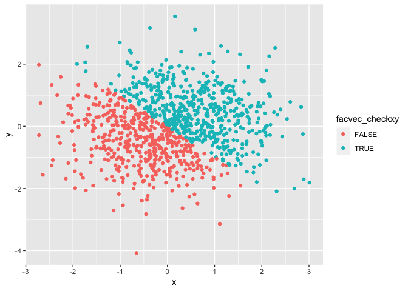
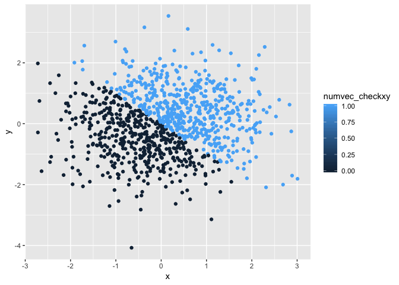

p8105\_hw1\_mm5354
================
Mengran Ma
2018/9/13

Problem 1
=========

Here's a **code chunk** that samples from a *uniform distribution*:

``` r
sample = runif(10, min = 0, max = 5)
```

I can take the mean of the sample, too! The mean is 2.2881633.

Next, creating the following required vectors: 1. A logical vector indicating whether elements of the sample are greater than 2 2. A (length-10) character vector 3. A (length-10) factor vector

``` r
vec_logical = sample > 2
vec_char = c("Kao","Shi","Xin","Chun","Ge","Yong","Yuan","Bu","Gua","Ke")
vec_factor = factor(c("a", "b", "c", "d", "e", "f", "g", "h", "i", "j"))
```

For each vector, get the means: Here is the mean for logical vector: 0.5

Here is the mean for character vector: NA

Here is the mean for factor vector: NA

Write a code chunk that applies the as.numeric function to the logical, character, and factor variables

``` r
convert_veclog = as.numeric(vec_logical)
convert_vecchar = as.numeric(vec_char)
```

    ## Warning: 强制改变过程中产生了NA

``` r
convert_vecfact = as.numeric(vec_factor)
```

What happens?

My answer is: Logical, and factor variables can be converted to numeric vectors, while in contrast, character variable/vector can not be converted to numeric vector. "NA" occurs in this converting character to numeric process.

In a second code chunk, convert your character variable from character to factor to numeric; similarly, convert your factor variable from factor to character to numeric.

``` r
facconvert_vecchar = as.factor(vec_char)
numconvert_vecchar = as.numeric(facconvert_vecchar)

charconvert_vecfac = as.character(vec_factor)
numconvert_vecfac = as.numeric(charconvert_vecfac)
```

    ## Warning: 强制改变过程中产生了NA

What happens?

My answer is: Character variable to factor to numeric can be converted/proceed successfully; However, converting factor variable to character to numeric did not work well comparing to the process above, since "NA" appears in this process when checking the numeric results.

Problem 2
=========

Create a data frame comprised of: x: a random sample of size 1000 from a standard Normal distribution

``` r
set.seed(2)

x = rnorm(1000, sd = 1)
```

y: a random sample of size 1000 from a standard Normal distribution

``` r
set.seed(2)

y = rnorm(1000, sd = 1)
```

A logical vector indicating whether the x + y &gt; 0

``` r
veclogical_checkxy = x + y > 0
```

A numeric vector created by coercing the above logical vector

``` r
numvec_checkxy = as.numeric(veclogical_checkxy)
```

A factor vector created by coercing the above logical vector

``` r
facvec_checkxy = as.factor(veclogical_checkxy)
```

I can take the size, mean, median of x, too!

-   The size of the dataset is 478, 522.

-   The mean of x is 0.0619987.

-   The median of x is 0.0501354.

-   The proportion of cases for which the logical vector is TRUE equals to 522.

Make a scatterplot of y vs x

``` r
set.seed(2)

## define data frame containing x and y
plot_df = tibble(
  x = rnorm(1000, sd = 1),
  y = rnorm(1000, sd = 1)
)
ggplot(plot_df, aes(x = x, y = y)) + geom_point()
```


``` r
ggplot(plot_df, aes(x = x, y = c(facvec_checkxy),color = 'pink')) + geom_point()
```



``` r
ggplot(plot_df, aes(x = x, y = c(numvec_checkxy),color = 'blue')) + geom_point()
```


